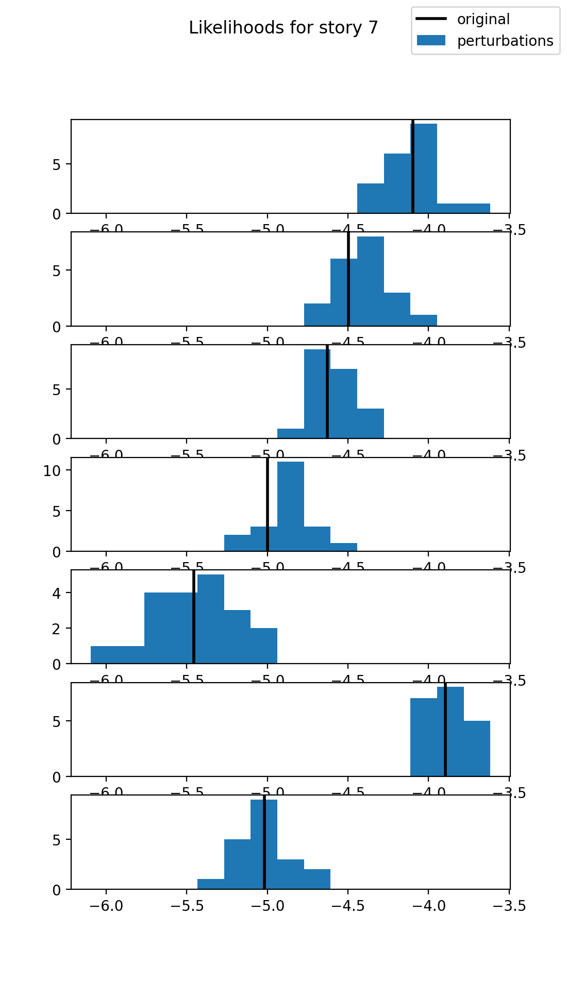
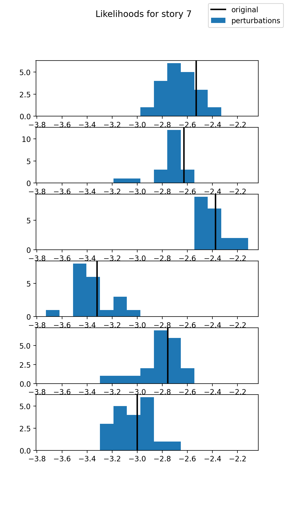
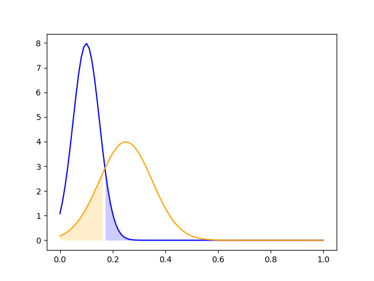

# cheatGPT
### Adversarial prompt-generation to test robustness of human/LLM text classifiers

## How2Use
- Use `python=3.9` (`>= 3.8` is fine), but 3.9 is the conda default for v3.0 and above. 
- If `detect-gpt` folder is empty, just run `git submodule init`, and `git submodule update` while in the `detect-gpt` folder.

## Bulletin
- conda env currently nonfunctional
    - existing env creation works
    - detect-gpt seems to require CUDA, which is incompatible with macOS
    - only submodule so far is detect-gpt, so submodule infrastructure is currently unused

## Requirements
I (Jacob) am working in a conda environment named `proj`, which can be created with the following commands:

### Option 1: environment.yml
> conda env create --file environment.yml

### Option 2: requirements.txt
> conda create --name proj --file requirements.txt

Environment requirements for this project are listed in `environment.yml`. I'm working in a conda environment named `proj`, which can be created with the following command:
> conda env create --file environment.yml

## Standards
- [GPT-2](https://openai.com/blog/better-language-models/) (1.5B) as language model (specifically [HuggingFace](https://huggingface.co/gpt2))
- The default passage length is 1000 tokens (defined in `generators/Generator.py`)
- for computing the expectation term in utility, the default number of samples is 10 (defined in `utility_function.py`)
    - For efficiency, all classes operating on samples (L, D, f) should be able to take in a list of samples and return a list of results via a `batch` method (example: `generators`)
- for components with prompt-specific and prompt-agnostic versions (that do or don't take in prompts), we define a general prompt-specific class and a prompt-agnostic subclass; setting the prompt attribute to `None` (example: `fitness_functions`)

## Structure

Replacable components (L, D, f) defined in folders
- each equipped with test.py for unit tests

[Submodules](https://git-scm.com/book/en/v2/Git-Tools-Submodules) for external code
- ex: [detectGPT](https://detectgpt.ericmitchell.ai/)
- Jacob sees no reason to edit those submodules (if you find one, please lmk!)

To initialize submodules, run the following commands in the cloned repo:

> git submodule init

> git submodule update


# Ryan's Scratchboard
## 1. Playing with DetectGPT
I used this script to run `run.py` (found in `n_perturb.sh`): 

```zsh
python run.py --output_name n_perturb --base_model_name facebook/opt-2.7b --mask_filling_model_name t5-large --n_perturbation_list 1,10,100,1000 --n_samples 100 --pct_words_masked 0.3 --span_length 2 --dataset writing
```

Reference list for `args`:
```python
args = {
  'dataset': 'writing',
  'dataset_key': 'document',
  'pct_words_masked': 0.3,
  'span_length': 2,
  'n_samples': 100,
  'n_perturbation_list': '1,10,100,1000',
  'n_perturbation_rounds': 1,
  'base_model_name': 'facebook/opt-2.7b',
  'scoring_model_name': '',
  'mask_filling_model_name': 't5-large',
  'batch_size': 50,
  'chunk_size': 20,
  'n_similarity_samples': 20,
  'int8': False,
  'half': False,
  'base_half': False,
  'do_top_k': False,
  'top_k': 40,
  'do_top_p': False,
  'top_p': 0.96,
  'output_name': 'n_perturb',
  'openai_model': None,
  'openai_key': None,
  'baselines_only': False,
  'skip_baselines': False,
  'buffer_size': 1,
  'mask_top_p': 1.0,
  'pre_perturb_pct': 0.0,
  'pre_perturb_span_length': 5,
  'random_fills': False,
  'random_fills_tokens': False,
  'cache_dir': '~/.cache'
}
```

## 2. What we have done so far
- Observed empirically that DetectGPT's hypothesis on Z-scores w.r.t perturbations is true.
- Observed empirically that our variance checking technique is possible 

### 2.1 Terminology
We have too many mean and variance statistics. Time to introduce some terminology to clean this up.
- $Z_{Segment, LLM}$: Z-score of likelihood of original text w.r.t to perturbation likelihoods, **for that segment**, for LLM.
- $Z_{Segment, Human}$ Z-score of likelihood of original text w.r.t to perturbation likelihoods, **for that segment**, for Human.

This means that, for example, we can derive 7 $Z_{Segment, Human}$'s from the plot on the left below, and 6 $Z_{Segment, LLM}$'s from the plot on the right.



<em>Left: Human, Right: LLM</em>

- $\mu_{Story, Z, LLM}, \sigma^2_{Story, Z, LLM}$: The mean and variance of $Z_{Segment, LLM}$'s, over all segments, for that story, for LLM text.
- $\mu_{Story, Z, Human}, \sigma^2_{Story, Z, Human}$: Same statistics as above, but for humans.
> Technically, the empirical sample variance we observe here is not $\sigma^2$, but $s^2$, but we can prove that for the purposes of our test, don't need to care because at some point the scalar difference between $\sigma^2$ and $s^2$ cancel out.

What we are aiming to prove is therefore: $\sigma^2_{Story, Z, Human} > \sigma^2_{Story, Z, LLM}$

Later on, we have to reason about the separation between the distributions of $\sigma^2_{Story, Z, Human}$ and $\sigma^2_{Story, Z, LLM}$, so we have to also put this in terms of the variance of these distributions, so we introduce:
- $\sigma_{\sigma^2, LLM}^2$: The variance of $\sigma^2_{Story, Z, LLM}$, over all the LLM stories.
- $\sigma_{\sigma^2, Human}^2$: The variance of $\sigma^2_{Story, Z, Human}$, over all the Human stories.

## 3. What we have to do (Experiments)
### 3.1 Proof Of Concept Experiment (POCE)
Sort of already did this, but the goal would be to do the "Early Perturbation Experiment" on 50 LLM texts and 50 Human texts, not just 20. If possible, we also need 50 perturbations  per text. 50 is just so that we can approximate this to a Normal Distribution, under Central Limit Theorem. After doing this, we will have:

1. Two distributions of 50 $\mu_{Story, Z, Author}$'s, one for each author type.
2. Two distributions of 50 $\sigma^2_{Story, Z, Author}$, one for each author type.

We ignore the $\mu_{Story, Z, Author}$ distributions, and focus on the $\sigma^2_{Story, Z, Author}$ ones. The idea is to plot those 2 $\sigma^2$ distributions and we'll get something like this:



Blue curve: $\sigma^2_{Story, Z, LLM}$, Orange curve: $\sigma^2_{Story, Z, Human}$

> Note that I make no statements on the shape of the above distributions. It is not necessarily true that either curve will be narrower / flatter than the other.

We then do Gaussian-Discriminant-Analysis (GDA) and say that any story with a $\sigma^2_{Story, Z}$ that comes on the right of the intersection point between the 2 curves is human-generated, anything on the left is LLM-generated. The blue shaded area corresponds to LLM text misclassified as human, and the orange shaded area corresponds to human text misclassified as LLM. Ideally, they are small.

Because we don't know the shapes of either curve ahead of time, we can't say if we will have high / low true / false positive / negatives. In general, we hope that:
- $\sigma^2_{\sigma^2, Author}$'s are small so that there is a clear separation and we have good test power. 

We can then calculate, the accuracy of our test, "by definition." I.E., by defining our cut-off this way, and by defining our probability disributions this way, in expectation what our accuracy and error rates will be. In particular, we will calculate:

1. $\hat{\text{Error}_\text{I}} = P(\text{classify as LLM} \mid \text{Human})$
2. $\hat{\text{Error}_\text{II}} = P(\text{classify as Human} \mid \text{LLM})$

### 3.2 The Baseline Experiment
How does Detect-GPT perform on non-GPT-2 texts? For this, we refer to the Detect-GPT paper. In doing their benchmarking (e.g. vs Supervised Detectors), they sample 150 test examples from r/WritingPrompts. We hence also sample 150 test examples. We just feed these prompts into {GPT-3, + at least 2 more} and get the Detect-GPT accuracy on those. That's our baseline; we **may** beat this. Detect-GPT performs with 0.98 accuracy on GPT-2. We will **very likely** not beat this.

### 3.3 The Big Experiment
We do this on the following datasets, **IN THIS ORDER**:
- w/WritingPrompts
- XSum (Narayan et al., 2018)

For each dataset, we have: 
- 500 human texts
- 125 ChatGPT texts
- 125 GPT-2 texts
- 125 GPT-Neo 2.7B texts
- 125 GPT-J 6B texts

Real use-case of our technique: we don't know what model it is, so we can't do model-specific training / testing. The best experiment will be to do leave-one-out cross-validation (LOO CV), i.e. figure out cut-off using 3 out of 4 of the LLMs vs human, and test on the last LLM vs human. But that's... a lot... or maybe that's ok. So perhaps the procedure is, for one iteration of LOO CV:

1. We figure out cutoff $Z$ score based on the distributions of: {125 GPT-2, 125 GPT-Neo, 125 GPT-J} vs {375 human} texts. 
2. We then test on the remaining 125 human texts vs 125 ChatGPT texts.

### 3.4 The statistics (if have time)
Prove that (conceptually, our calculations based on sample variance does not underestimate / overestimate the actual, which is based on population variance):

1. $\mathbb{E}[\hat{\text{Error}_\text{I}}] = \text{Error}_\text{I}$
2. $\mathbb{E}[\hat{\text{Error}_\text{II}}] = \text{Error}_\text{II}$

## 4. Actual TODOs FFS...

1. Write code to:
  - Select 500 prompts, filter for the human text samples, clean, and separate into individual `.txt` files.
  - Randomly split into 4 x 125 prompts, generate LLM text (1 model per 125), separate into individual `.txt` files. Record somewhere which stories were generated by which LLM
2. Finish POCE.

# Data Generation
## 5 Datasets we use:
- `writing` (prompt-based)
- `english`
- `german`
- `pubmed` (prompt-based)
- `xsum` (default)

## Prompt-Based Datasets
We scaffold the prompt to an LLM by dataset:
### `pubmed`:
  - `"Question: {prompt} Answer: " {LLM RESPONSE}`
### `writing`:
  - `"Write a story based on this prompt: {prompt} " {LLM_RESPONSE}`

LLM texts are just the `"{LLM_RESPONSE}"` parts **without** the scaffolding, and human texts are just the human responses, without the prompts.

## Non-Prompt-Based Datasets (e.g. `xsum`)
1. Take first 30 tokens of human text, and treat as "prompt". 
2. Generate LLM text based on this prompt.
3. LLM text consists of **only** the LLM-generated "response" to the prompt.
4. Human text consists of **only** the part that came after the 30 tokens.

# Perturbing Pipeline
`python perturb.py --folder_to_perturb inputs/human --ll_save_loc results/gpt2-medium-scorer/human --folder_of_perturbs perturbations/human --mode perturb --num_perturbations 50`

## Data Organization (`inputs`)
- `inputs`
  - `human`
    - `squad`
    - `xsum`
    - `writing`
  - `LLM`
    - `squad`
    - `xsum`
    - `writing`
  - `prompt`
    - `squad`
    - `xsum`
    - `writing`
  - `args`

## Data Organization (`results` and `perturbations`)
- `results`
  - `{scoring_model_name}`
    - `{human or LLM}`
      - `{dataset}`
- `perturbations`
  - `{human or LLM}`
    - `{dataset}`
    

# Progress
## Data Generation
Done.

## Perturbation
- [ ] `human/squad`